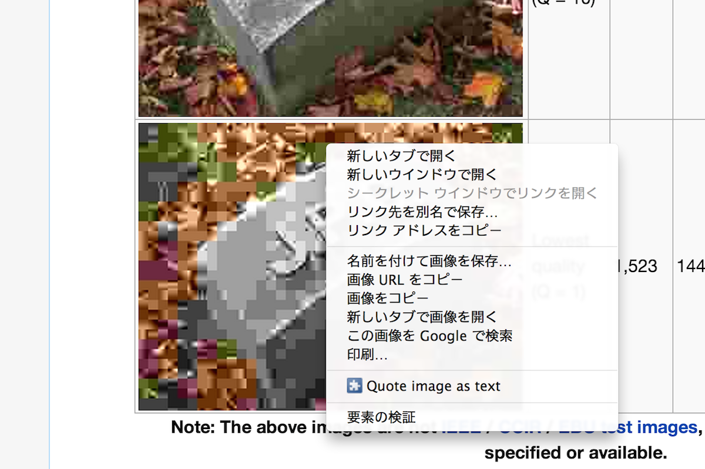

Quote Image As Text
===================

A chrome extension to quote arbitary images as a markdown text.
Adds a context menu on images to copy a markdown text which embeds the image.

Useful for attaching web images, e.g. pull request comments.

Generates an image tag inside a link tag which links to the page where the image is found at.

[](https://chrome.google.com/webstore/detail/quote-image-as-text/fjjehanehnaejfgnmkgebkefbdnebbkc)

In the case above generates like below:

```markdown
[](http://en.wikipedia.org/wiki/JPEG)
```

Which renders like:

[](http://en.wikipedia.org/wiki/JPEG)

The logo image is built using [Font Awesome](http://fortawesome.github.io/) and [Markdown Mark](https://github.com/dcurtis/markdown-mark).
